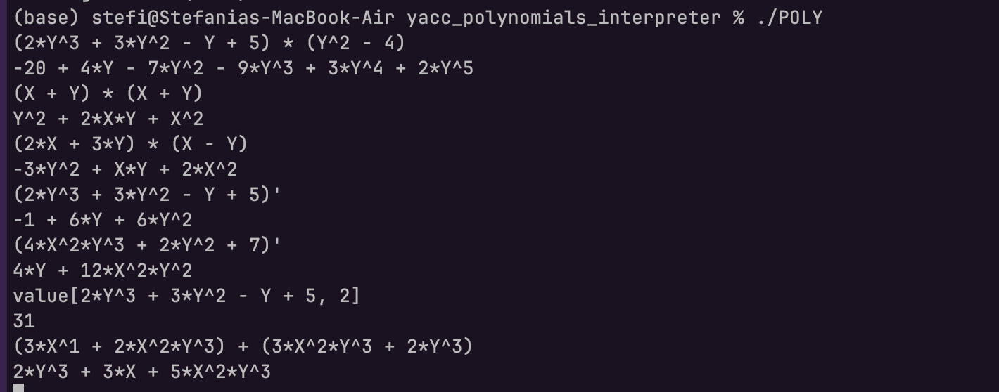

# Polynomial Interpreter (Two-Variable)

A YACC/LEX-based interpreter for two-variable polynomial expressions in **X** and **Y**.  
Supports addition, subtraction, multiplication, derivation (with respect to Y), and value evaluation.

---

## Build

```bash
yacc -d polinom.y
lex polinom.l
gcc -o POLY lex.yy.c y.tab.c -ly -ll
```

---

## Run

```bash
./POLY
```

The interpreter reads from **standard input**, one expression per line. Press `Ctrl+D` to exit.

---

## Syntax

### Terminals
| Token | Meaning |
|-------|---------|
| `NUMBER` | Integer literal (e.g. `3`, `42`) |
| `X` | Variable X |
| `Y` | Variable Y |
| `X ^ NUMBER` | X raised to a power |
| `Y ^ NUMBER` | Y raised to a power |

### Operators
| Operator | Description | Example |
|----------|-------------|---------|
| `+` | Polynomial addition | `X ^ 2 + Y` |
| `-` | Polynomial subtraction | `X ^ 3 - 2 * Y ^ 2` |
| `*` | Polynomial multiplication | `(X + 1) * (X - 1)` |
| `(expr)'` | Derivative with respect to **Y** | `(3 * X * Y ^ 2 + Y)'` |
| `value[expr, N]` | Evaluate polynomial at X=Y=N | `value[X ^ 2 + Y, 3]` |

Parentheses `(` `)` can be used freely to control priority.

---

## Polynomial Storage

Polynomials are stored as a **10×10 coefficient matrix** `arr[i][j]`,  
where `arr[i][j]` is the coefficient of **X^i · Y^j**.

> Maximum supported degree: 9 per variable.

---

## Examples

### Addition
```
X ^ 2 + 2 * Y + 3
```
Output:
```
3 + 2*Y + X^2
```

### Subtraction
```
X ^ 3 - X ^ 2 + X - 1
```
Output:
```
-1 + X - X^2 + X^3
```

### Multiplication — single variable
```
(2 * Y ^ 3 + 3 * Y ^ 2 - Y + 5) * (Y ^ 2 - 4)
```
Output:
```
-20 - 4*Y + 20*Y^2 - 9*Y^3 + 3*Y^4 + 2*Y^5
```
> **Expected result:** `2Y^5 + 3Y^4 – 9Y^3 – 7Y^2 + 4Y – 20` ✓

### Multiplication — two variables
```
(X + Y) * (X - Y)
```
Output:
```
-Y^2 + X^2
```

### Derivation (with respect to Y)
```
(3 * X * Y ^ 2 + 2 * Y + 5)'
```
Output:
```
2 + 6*X*Y
```

### Value evaluation
```
value[X ^ 2 + 2 * X + 1, 3]
```
Output:
```
16
```
> Evaluates (3² + 2·3 + 1) = 9 + 6 + 1 = 16

---

## Test Run



---

## File Structure

| File | Description |
|------|-------------|
| `polinom.l` | LEX lexer — tokenises numbers, variables, operators |
| `polinom.y` | YACC grammar + all polynomial functions |
| `lex.yy.c` | Generated lexer (from `lex polinom.l`) |
| `y.tab.c` / `y.tab.h` | Generated parser (from `yacc -d polinom.y`) |
| `POLY` | Compiled executable |

---

## Implementation Notes

- **`initialize_array`** — zeroes the 10×10 coefficient matrix  
- **`add_arrays`** / **`subtract_arrays`** — element-wise sum/difference  
- **`multiply_arrays`** — polynomial multiplication via convolution of coefficient matrices  
- **`derive_array`** — shifts Y-degree coefficients down by one, multiplying by old degree  
- **`compute_value`** — evaluates `P(x, x)` using Horner's method  

